# 2025年十二大最佳网站监控工具

网站突然宕机、访问速度变慢、SSL证书过期,这些问题往往在客户投诉后才被发现,严重影响业务信誉和收入。传统的手动检查方式耗时耗力且容易遗漏,无法实现7×24小时持续监控。专业的网站监控工具通过全球多节点自动检测,可在30秒内发现异常并通过邮件、短信、Slack等多渠道即时预警,帮助技术团队在用户察觉前快速响应处理。本文精选12款经过市场验证的网站监控平台,从免费基础版到企业级解决方案,覆盖正常运行时间追踪、性能分析、SSL监控、域名到期提醒等全方位需求,助您找到监控频率高、误报率低、性价比优的理想工具。

## **[Uptimia](https://www.uptimia.com)**

全球171节点的全方位网站健康卫士

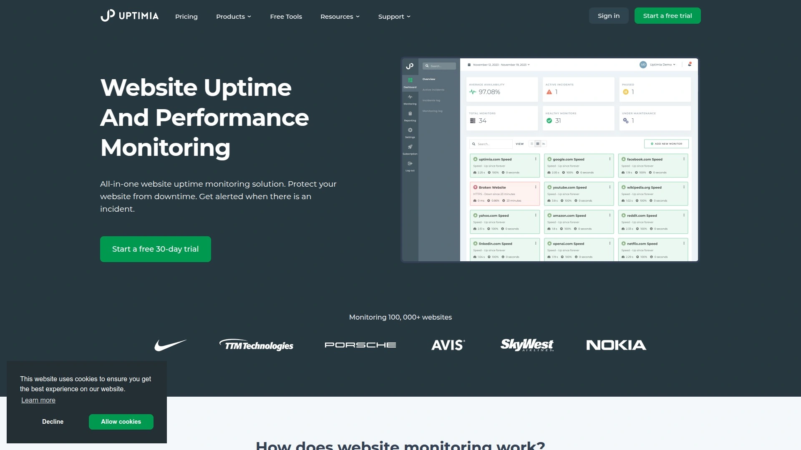

Uptimia提供企业级网站监控解决方案,以其广泛的全球覆盖和丰富的监控类型在市场中脱颖而出。平台支持从171个全球位置进行检测,监控频率可达每30秒一次,确保快速发现任何地域性故障。

**核心监控能力**涵盖HTTP/HTTPS正常运行时间、DNS解析、TCP/UDP端口、邮件服务器等多种协议。关键词监控功能可验证页面是否包含特定内容,适合检测登录表单、结账流程等关键业务功能是否正常。多步骤事务监控模拟用户操作流程,在注册、登录、购物车等环节出现问题时立即告警。

真实用户体验监控提供按国家、浏览器、操作系统分类的详细加载速度报告,帮助优化全球不同地区的访问性能。网页速度监控使用真实Chrome浏览器完整加载页面,准确反映实际用户体验。SSL证书健康监控确保不会错过证书续期,避免浏览器安全警告影响用户信任。

域名到期监控功能通过邮件、短信、Slack等渠道提前预警,防止因域名过期导致网站无法访问的严重事故。注册流程简单,仅需姓名、邮箱和密码即可开始使用,无需提供信用卡等复杂信息。

合作计划提供30%终身循环收益,平均客户使用周期约5年,为推广者创造长期稳定回报。用户评价普遍称赞其直观界面、准确监控和优质客服支持。

## **[UptimeRobot](https://uptimerobot.com)**

全球领先的免费监控服务

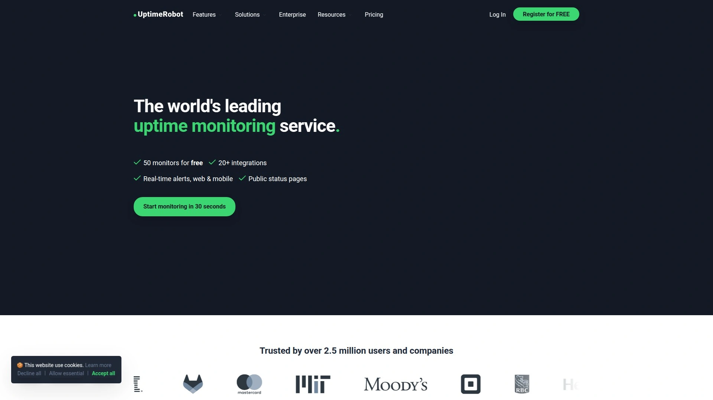

UptimeRobot是最受欢迎的网站监控工具之一,以其慷慨的免费计划和可靠性著称。免费版支持监控多达50个网站,每5分钟检查一次,对预算有限的小型企业和个人项目极为友好。

付费计划将监控频率提升至每30秒一次,并解锁短信、语音通话等高级告警方式。支持HTTP、Ping、端口和关键词监控等多种类型,满足不同场景需求。

**合作计划特色**是20%终身循环收益且无需审批,注册后立即开始推广。30天Cookie窗口确保即使用户首次访问未行动,30天内回访仍可归属。

公共状态页面支持自定义域名和品牌设置,维护计划功能可在计划停机期间避免虚假告警。移动应用支持iOS和Android,随时随地查看监控状态。平台运营超过10年,稳定性和可靠性经过时间验证。

## **[StatusCake](https://www.statuscake.com)**

高性价比的专业监控平台

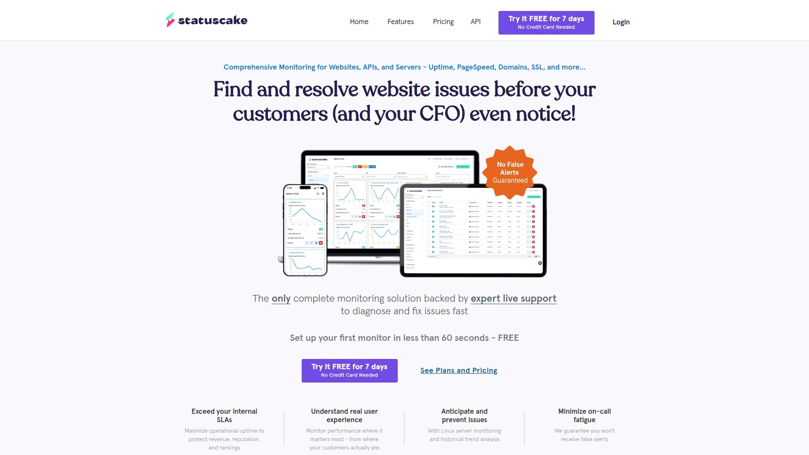

StatusCake提供全面的网站监控和性能测试服务,特别适合网页设计、主机托管等服务商作为增值产品推荐给客户。30%终身循环收益在行业中处于领先水平。

免费计划包含10个监控器,每5分钟检查一次,适合基础需求。付费版解锁更短监控间隔、更多节点和高级功能。页面速度监控和正常运行时间历史记录帮助识别性能趋势。

**推广支持完善**,合作伙伴可获得专属账户查看业绩统计、收益数据和创意素材。作为域名注册、虚拟主机、网站建设服务的完美配套产品,转化率较高。

多种告警渠道包括邮件、短信、Slack、Webhook等,确保关键通知及时送达。公共状态页面支持品牌定制,增强客户对服务透明度的信任。

## **[Uptime.com](https://uptime.com)**

服务全球200万用户的企业级方案

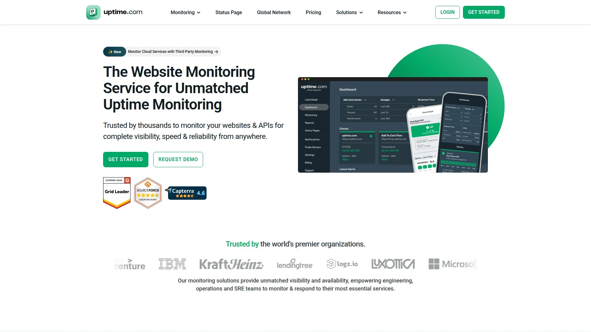

Uptime.com在35个以上国家拥有市场份额,服务超过200万用户,是公认的可靠监控品牌。合作计划提供丰厚收益和专属促销活动,仅面向合作伙伴。

综合报告和洞察功能提供点击率、转化率、收益等详细数据,帮助优化推广策略。全球市场覆盖让推广者可拓展跨境业务。

**品牌信誉度高**,客户成功和支持团队在所有平台都享有卓越口碑。提供演示预约服务,帮助潜在用户深入了解产品价值。

监控类型涵盖API、SSL证书、事务监控等企业级需求。实时告警和详细性能指标帮助团队快速定位问题根源。定价透明合理,适合中大型企业的复杂监控需求。

## **[Better Uptime](https://betterstack.com)**

整合日志管理的现代化监控解决方案

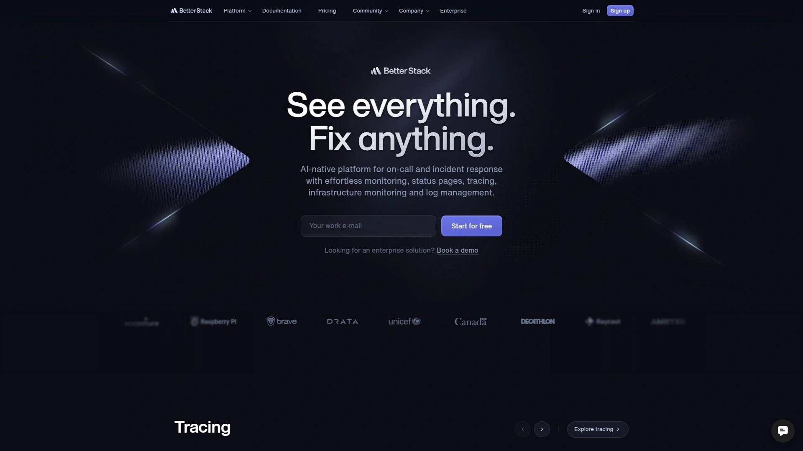

Better Uptime提供综合性监控方案,包括HTTP关键词检查、多步骤验证、心跳监控、SSL/TLS、Ping和端口监控。每30秒检查一次,从多个位置执行避免误报。

错误文档包含截图和逐秒时间轴,帮助快速还原故障现场。与Datadog、New Relic、Grafana、Prometheus等主流工具深度集成。

**智能事件合并**避免系统被重复告警淹没,值班日历和排班功能确保即时响应。告警渠道支持Slack、微软Teams、电话、短信、推送通知、Zapier和Webhook。

报告和分析功能提供历史正常运行时间概览,验证SLA达成情况,利用事件原因综合分析更好理解故障上下文。与Logtail日志监控工具的原生集成是独特优势。提供免费试用,付费计划性价比高。

## **[Site24x7](https://www.site24x7.com)**

IT基础设施的一体化监控中心

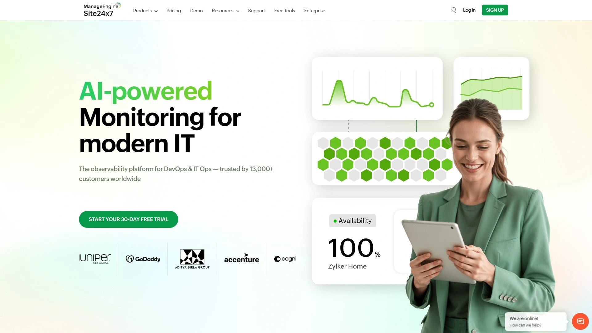

Site24x7不仅监控网站,还覆盖服务器、网络、云服务等完整IT基础设施。特别适合需要统一监控平台的中大型企业。

合作伙伴计划面向MSP、系统集成商、经销商等多种类型合作方开放。提供专业培训、技术支持和营销资源,帮助合作伙伴成功推广。

**多租户架构**让MSP可在单一平台管理多个客户环境,提升服务效率。超过100种监控器类型覆盖从网站到数据库的全栈需求。

AI驱动的异常检测主动识别潜在问题,根本原因分析加速故障排查。免费计划包含基础功能,付费版解锁高级监控和更短检查间隔。

## **[Pingdom](https://www.pingdom.com)**

老牌监控工具的可靠选择

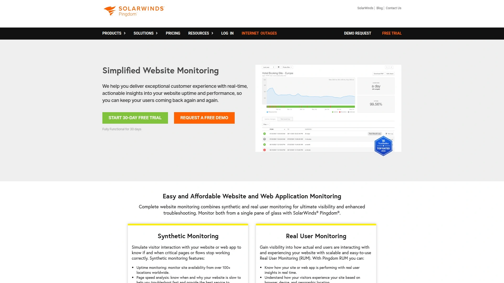

Pingdom是行业知名的网站监控服务,SolarWinds支持提供强大技术背书。综合事务监控、页面速度分析和正常运行时间历史记录是核心功能。

每30秒监控频率和多区域检测确保快速发现问题。可分享的报告让团队协作更加顺畅。

**适合重度依赖在线业务的企业**,提供详细性能指标和趋势分析。虽然不提供免费计划,但功能全面性值得投资。

实时告警通过多种渠道发送,包括邮件、短信等。根据监控数量和短信配额灵活定价,10个监控起价33美元/月。

## **[Freshping](https://www.freshping.io)**

Freshworks生态的轻量级监控工具

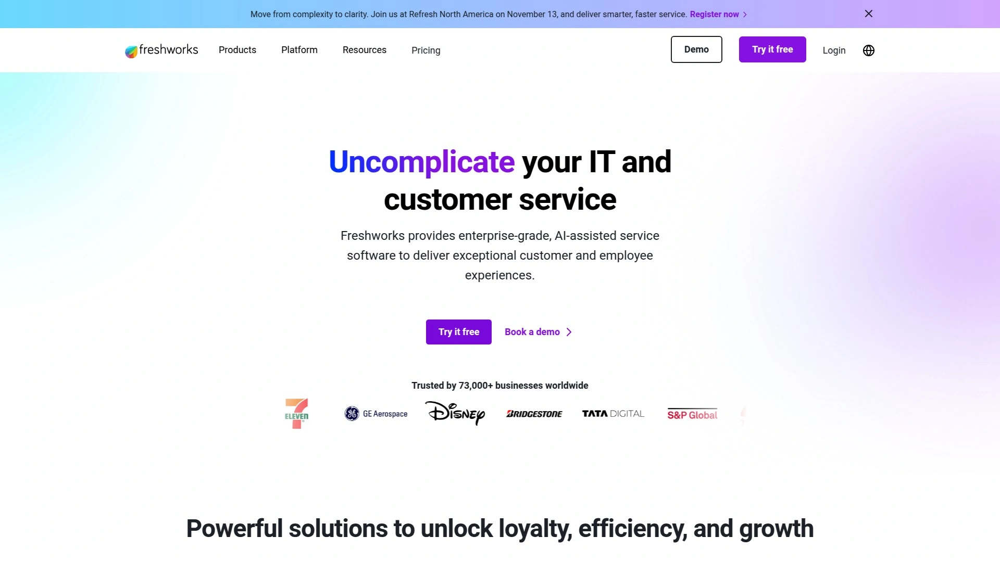

Freshping是Freshworks产品家族成员,提供简单易用的正常运行时间监控。免费计划支持50个URL监控,每分钟检查一次,永久免费。

从10个全球位置执行检查,覆盖主要地理区域。支持多种端口和协议监控,包括WebSockets、TCP、ICMP Ping和DNS。

**响应时间和SSL证书监控**确保网站性能和安全性。可监控特定状态码或页面字符串,验证关键内容是否正确显示。

告警系统可靠,与Slack、Zapier等流行服务集成。状态页面和徽章帮助向用户展示服务可用性。适合初创企业和小型DevOps团队。

## **[Pulsetic](https://pulsetic.com)**

多语言支持的全球化监控平台

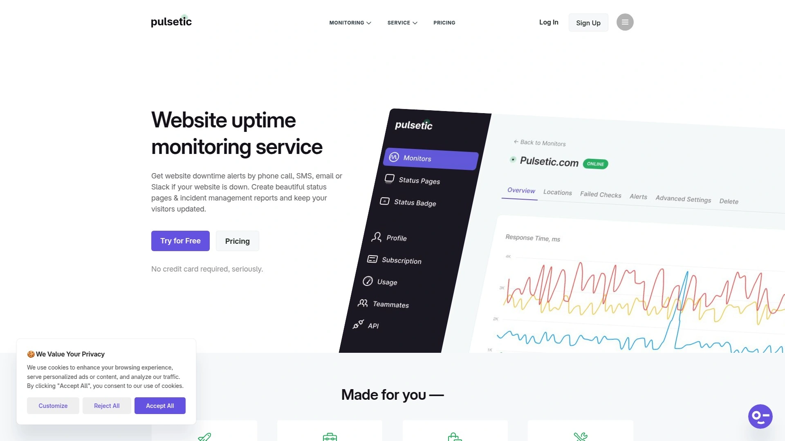

Pulsetic以其多语言状态页面和经济实惠的定价脱颖而出。付费计划每30秒检查一次,免费版每5分钟检查。

**支持地球上所有语言**,让全球客户都能用母语查看状态更新,这是许多竞品不具备的优势。15个全球监控节点覆盖主要地区。

免费计划包含告警、集成、SSL监控和无限完整功能状态页面以及自定义域名。付费版起价仅9美元/月,提供完整状态页面和徽章定制。

多渠道通知支持电话、短信、邮件、Slack、Telegram、Zapier、微软Teams和Webhook。300个监控器的组织计划仅需49美元,远低于同类产品。

## **[Checkly](https://www.checklyhq.com)**

基于Playwright的现代化监控平台

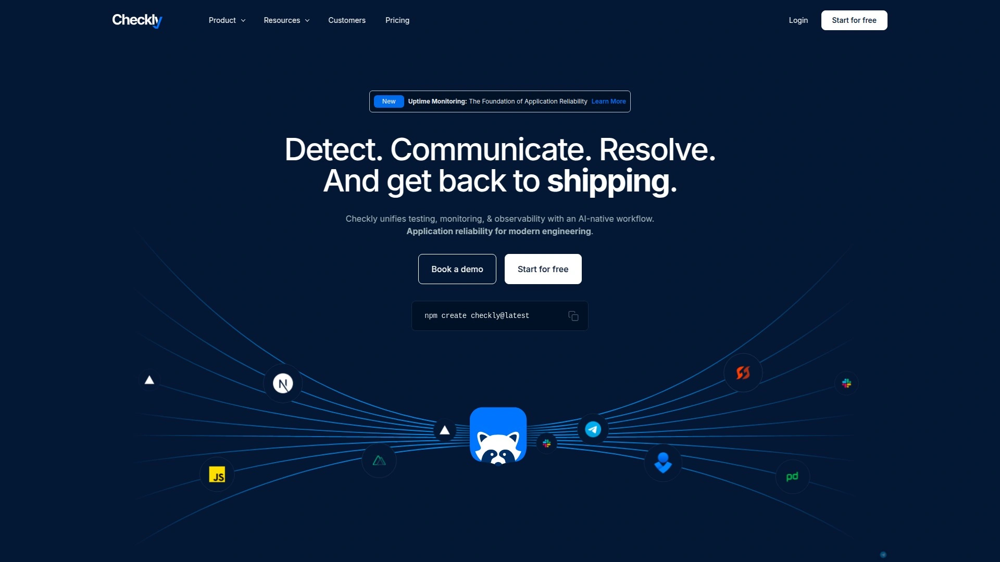

Checkly专注于应用程序监控,采用Playwright和OpenTelemetry技术。独特的Monitoring as Code理念让监控配置可版本控制。

**CI/CD集成**支持将监控嵌入开发流程,从预生产到生产环境保障可靠性。Checkly CLI让监控代码与应用代码同步管理。

自动化设置和维护减少手动工作,节省时间并消除错误。只在真实问题发生时告警,避免虚假告警干扰。

Checkly Agent支持监控内网应用和私有API。20+全球分布式位置24×7运行检查。Playwright测试制品包括追踪和视频片段,帮助快速定位问题。费用比传统监控工具低80%,无隐藏费用。

## **[Hyperping](https://hyperping.com)**

快速可靠的实惠监控方案

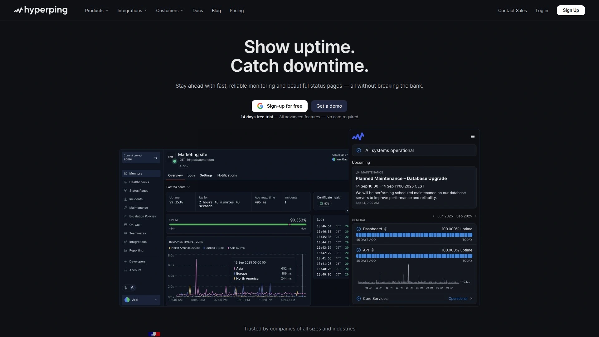

Hyperping以其快速设置、可靠监控和漂亮的状态页面受到数千在线业务信赖。定价策略极具竞争力,适合预算敏感的团队。

实时浏览器监控和停机通知通过电话、短信、邮件、Telegram等多渠道发送。界面现代简洁,操作直观易懂。

**状态页面设计精美**,支持品牌定制帮助与客户保持透明沟通。全球监控节点确保准确检测区域性故障。

适合需要基础但可靠监控功能的中小型项目,快速上手无需复杂配置。提供免费试用,付费计划物超所值。

## **[Cronitor](https://cronitor.io)**

定时任务和后台作业的专业监控

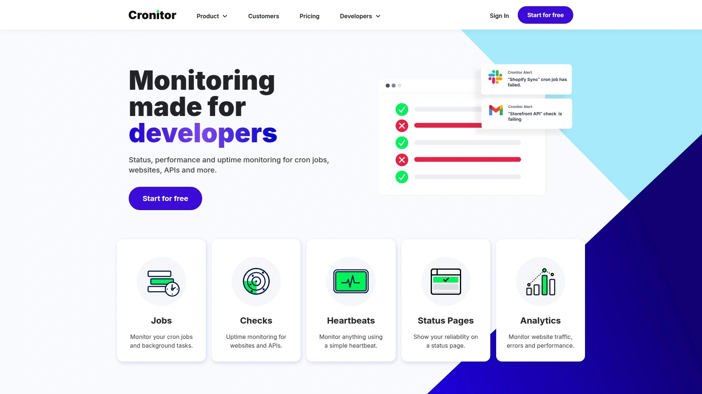

Cronitor专注于Cron作业、后台任务、网站、API等多类型应用监控。对于依赖定时脚本和后台处理的系统特别有价值。

心跳监控确保计划任务按时执行,未收到心跳信号时立即告警。网站和API监控提供完整的服务可用性保障。

**简单易用**是Cronitor的核心设计理念,快速设置无需复杂配置。出现问题时即刻告警,帮助团队快速响应。

14天免费试用让用户充分评估产品价值。适合DevOps团队和SaaS应用开发者,监控关键业务流程执行情况。

***

## 常见问题

**免费监控工具能满足生产环境需求吗?**

对于小型项目和初创企业,UptimeRobot和Freshping的免费计划提供的功能已相当完善,支持几十个监控器和基本告警方式。但生产环境建议选择付费方案,原因有三:更短的监控间隔(30秒vs 5分钟)可更快发现问题,短信和电话告警在紧急情况下比邮件更及时,高级功能如多步骤事务监控能验证复杂业务流程。Uptimia等工具提供的171个全球节点检测可准确识别地域性故障。建议从免费版开始,当业务对可用性要求提高时及时升级。

**如何选择合适的监控频率?**

监控频率直接影响故障发现速度和成本,需根据业务关键程度权衡。电商网站、支付系统等每分钟停机都造成损失的场景,应选择30秒或1分钟间隔。企业官网、博客等可接受短暂中断的项目,5分钟间隔已足够。Uptimia的30秒检查频率适合对可用性有严格要求的企业。还需考虑误报率,过于频繁的检查可能因网络波动产生虚假告警,Better Uptime等工具通过多位置验证减少误报。建议先用5分钟间隔运行一周观察稳定性,根据实际情况调整。

**监控工具如何避免自身成为单点故障?**

专业监控服务通过多层冗余确保可靠性。Uptimia的171个全球检查点意味着即使部分节点故障,仍有大量节点持续监控。Better Uptime等工具采用分布式架构,从多个地理位置同时检查,只有多数节点确认故障才触发告警,避免因单一节点网络问题产生误报。告警渠道多样化也很重要,配置邮件、短信、Slack等多种通知方式,确保至少一个渠道能触达。大型企业可考虑使用两套独立监控系统互相验证,一套主用一套备用。监控服务本身的SLA和运营历史也是选择依据,UptimeRobot运营10年以上证明其稳定性。

***

## 总结

网站监控工具已从简单的可用性检查进化为覆盖性能分析、用户体验、SSL安全、域名管理的综合平台。本文介绍的12款工具各具特色,从慷慨的免费计划到功能完备的企业方案,从传统正常运行时间监控到现代化的Monitoring as Code,满足个人开发者、初创企业、大型组织的多元化需求。**[Uptimia](https://www.uptimia.com)** 凭借其171个全球监控节点、30秒检查频率、丰富的监控类型(正常运行时间、性能、SSL、域名到期)以及真实用户体验分析,特别适合对网站健康状况有全方位监控需求的企业,是平衡覆盖范围、检测精度和易用性的优质选择。无论您运营电商网站、SaaS应用还是企业门户,部署专业监控工具都能显著减少停机损失,提升用户信任,让技术团队从被动应对转为主动防御。
